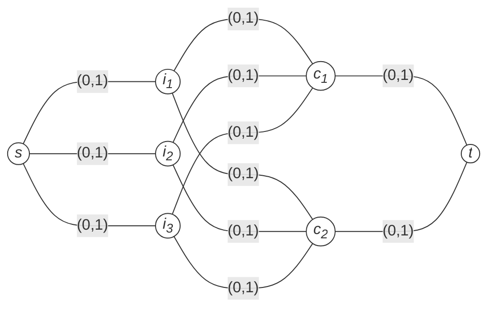

```mermaid

%% graph LR
%%     i_1((i_1))
%%     i_2((i_2))
%%     i_3((i_3))
%%     c_1[c_1<br/>枠:1]
%%     c_2[c_2<br/>枠:1]
    
%%     i_1 --- c_1
%%     i_1 -.削除.- c_2
%%     i_2 -.削除.- c_1
%%     i_2 -.削除.- c_2
%%     i_3 -.削除.- c_1
%%     i_3 --- c_2
    
%%     style c_1 fill:#e1f5ff
%%     style c_2 fill:#fff5e1
%%     style i_2 fill:#ffcccc


%% graph LR
%%     i1(("<i>i<sub>1</sub></i>"))
%%     i2(("<i>i<sub>2</sub></i>"))
%%     i3(("<i>i<sub>3</sub></i>"))

%%     c1(("<i>c<sub>1</sub></i>"))
%%     c2(("<i>c<sub>2</sub></i>"))

%%     %% 接続関係
%%     i1 ----- c1
%%     %% i1 -.- c2
%%     %% i2 -.- c1
%%     %% i2 -.- c2
%%     %% i3 -.- c1
%%     i3 ----- c2

%%     %% 全体のスタイルリセット（枠線を黒、背景を白に固定）
%%     classDef plain fill:#fff,stroke:#333,stroke-width:1px;
%%     class i1,i2,i3,c1,c2 plain


graph LR
    %% ノード定義
    S(("<i>s</i>"))
    T(("<i>t</i>"))
    
    i1(("<i>i<sub>1</sub></i>"))
    i2(("<i>i<sub>2</sub></i>"))
    i3(("<i>i<sub>3</sub></i>"))
    
    c1(("<i>c<sub>1</sub></i>"))
    c2(("<i>c<sub>2</sub></i>"))

    %% Sourceからエージェント層への接続
    S -- "(0,1)" ---- i1
    S -- "(0,1)" ---- i2
    S -- "(0,1)" ---- i3

    %% エージェント層からカテゴリ層への接続
    i1 -- "(0,1)" ---- c1
    i1 -- "(0,1)" ---- c2
    i2 -- "(0,1)" ---- c1
    i2 -- "(0,1)" ---- c2
    i3 -- "(0,1)" ---- c1
    i3 -- "(0,1)" ---- c2

    %% カテゴリ層からSinkへの接続
    c1 -- "(0,1)" ---- T
    c2 -- "(0,1)" ---- T

    %% スタイル設定（背景白、黒枠、直線）
    classDef plain fill:#fff,stroke:#333,stroke-width:1px;
    class S,T,i1,i2,i3,c1,c2 plain

```